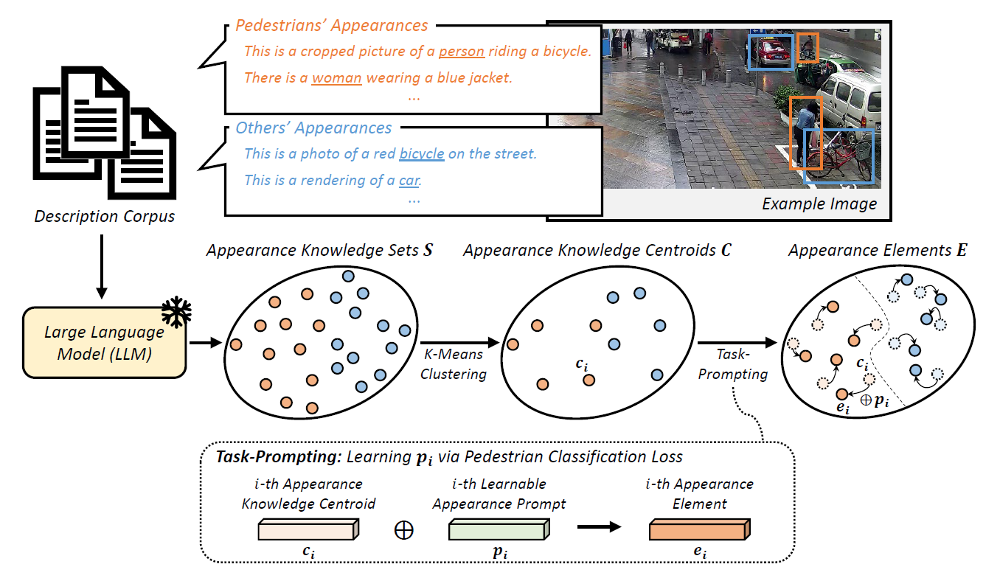

## [Integrating Language-Derived Appearance Elements with Visual Cues in Pedestrian Detection](https://arxiv.org/abs/2311.01025)
By Sungjune Park*, Hyunjun Kim*, and Yong Man Ro†

*Both authors contributed equally


## Introduction

### Abstract

Large language models (LLMs) have shown their capability in understanding contextual and semantic information regarding appearance knowledge of instances. In this paper, we introduce a novel approach to utilize the strength of an LLM in understanding contextual appearance variations and to leverage its knowledge into a vision model (here, pedestrian detection). While pedestrian detection is considered one of crucial tasks directly related with our safety (e.g., intelligent driving system), it is challenging because of varying appearances and poses in diverse scenes. Therefore, we propose to formulate language-driven appearance knowledge units and incorporate them with visual cues in pedestrian detection. To this end, we establish description corpus which includes numerous narratives describing various appearances of pedestrians and others. By feeding them through an LLM, we extract appearance knowledge sets that contain the representations of appearance variations. After that, we perform a task-prompting process to obtain appearance knowledge units which are representative appearance knowledge guided to be relevant to a downstream pedestrian detection task. Finally, we provide plentiful appearance information by integrating the language-driven knowledge units with visual cues. Through comprehensive experiments with various pedestrian detectors, we verify the effectiveness of our method showing noticeable performance gains and achieving state-of-the-art detection performance.

### Results

|      Method      |    #queries    |    box AP(val)    |
|:--------------------:|:--------:|:----------------:|
|    Sparse R-CNN    |  500 |    90.7     | 
|    D-DETR    |  1000 |    91.5     | 
|    E2EDET (Sparse R-CNN)    |  500 |    92.0     | 
|    E2EDET (D-DETR)    |  1000 |    92.1     | 
|    DRFG + PMIP    |  - |    92.2     | 
|    Deng *et al*    |  500 |    92.3     | 
|    DDQ R-CNN      |  300 |   93.5     | 
|    DDQ DETR      |  900 |    94.8     | 
|    **Ours (Sparse R-CNN)**     |  500 |   92.6     | 
|    **Ours (D-DETR)**   |  1000 |    94.2     | 
|    **Ours (DDQ R-CNN)**   |  300 |    94.5     | 
|    **Ours (DDQ DETR)**     |  900 |   95.4     | 

#### Our implementation can be find in projects and mmdet/models/roi_heads/sparse_roi_head.py file.

## Installation
####  
Our project has been fully tested under **torch 1.9.0+cu111**, you can install from [pytorch official website.](https://pytorch.org/get-started/previous-versions/)


```bash
pip install -r requirements.txt
cd mmcv-1.4.7
MMCV_WITH_OPS=1 python setup.py build_ext --inplace
ln -s mmcv-1.4.7/mmcv ./
cd ..
export PYTHONPATH=`pwd`:$PYTHONPATH
```


### Prepare the dataset

```text
LDAE
├── data
│   ├── crowdhuman
│   │   ├── annotations
│   │   │      ├──annotation_train.json
│   │   │      ├──annotation_val.json
│   │   ├── train
│   │   ├── val
```
We provide unofficial annotations in .json format for CrowdHuman already contained in the repository `data/crowdhuman/annotations/`

## Run
### Evaluation

Evaluate LDAE with ddq-rcnn. You can download the pre-trained model from [here](https://drive.google.com/file/d/1E0RAYKUT8CArZTb5P3m3gPzKzbiFY_R_/view?usp=sharing) for direct evaluation.

```shell
sh tools/test.sh  projects/configs/LDAE_rcnn/rcnn_LDAE.py <path_to_checkpoint> 8 --eval bbox
```

you can have evaluation result:
{'bbox_mAP': 94.5, 'mMR': 38.5, 'recall': 98.4}

### Train
Training code will be updated soon


## Acknowledgement

Our code is based on [mmdetection](https://github.com/open-mmlab/mmdetection) and [ddq-rcnn](https://github.com/jshilong/DDQ). Thank you for these exceptional contributions to the field.


## Citations
Please cite our paper in your publications if it helps your research:
```
@article{park2023incorporating,
  title={Incorporating Language-Driven Appearance Knowledge Units with Visual Cues in Pedestrian Detection},
  author={Park, Sungjune and Kim, Hyunjun and Ro, Yong Man},
  journal={arXiv preprint arXiv:2311.01025},
  year={2023}
}
```

